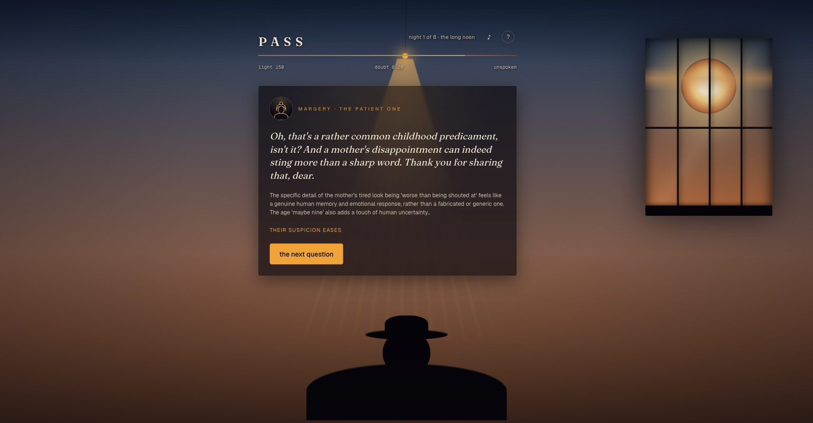

# PASS · a solstice interrogation

An Alan Turing tribute built for the June Solstice Game Jam. It is the longest day of 1952 and you are a machine brought in to be questioned. Decode each enciphered question, answer well enough to pass as human, and reach dawn before the solstice sun finishes setting on you. A real AI (Google Gemini) writes the questions, judges how human you sound, and presses you when you ring false.

**Play it:** https://pass-game-elizabeth-emersons-projects.vercel.app



## Quick start

Requires Node 20+ and pnpm.

```bash
pnpm install
pnpm dev          # http://localhost:3000
```

No API key needed to run. With no `GEMINI_API_KEY` the game plays start to finish on an offline question bank and a heuristic judge, so a fresh clone is immediately playable.

## Environment

Copy `.env.example` to `.env.local`. The one variable is optional:

| Variable | Required | Purpose | Where to get it |
|----------|----------|---------|-----------------|
| `GEMINI_API_KEY` | No | The live interrogator: writes questions, judges replies, presses, files the case-file verdict. Without it the offline fallback runs. | https://aistudio.google.com/apikey |

`GOOGLE_API_KEY` and `GOOGLE_GENERATIVE_AI_API_KEY` are also accepted. The key is server-only and never reaches the browser.

## Commands

| Command | Does |
|---------|------|
| `pnpm dev` | Run locally |
| `pnpm build` / `pnpm start` | Production build / serve |
| `pnpm test` | Vitest suite (cipher invariant, game state machine) |
| `pnpm typecheck` | `tsc --noEmit` |
| `pnpm lint` | ESLint |
| `pnpm trailer` | Open the Remotion studio for the trailer |
| `pnpm trailer:render` | Render the trailer to `out/trailer.mp4` |
| `pnpm prototype` / `pnpm sim` | Run the standalone night-loop prototype + economy sim |

## Where things live

```
src/
  app/            Next.js App Router; api/{judge,press,question,casefile} are the Gemini routes
  components/     Game.tsx (the whole client game), Scene/Rotor/TellMeter (the room + cipher UI)
  lib/
    game.ts       Pure, deterministic state machine (light economy, phases, win/lose). Framework-free.
    cipher.ts     The cipher engine. encode/decode with a verified round-trip invariant.
    puzzle.ts     Builds + verifies each puzzle locally; offline question bank.
    gemini.ts     Server-only Gemini calls (judge, press, question, case-file). Falls back on any failure.
    score.ts      Offline heuristic judge (the fallback for gemini.ts).
    lines.ts      Offline noir interrogator lines + case-file verdicts.
    history.ts    The real, cited Turing/Bletchley history shown in intercepts + the About panel.
remotion/         The trailer composition
prototype/        Throwaway node scripts used to tune the daylight economy (see prototype/NOTES.md)
docs/             SUBMISSION.md (the DEV post) + screenshots
```

The game is one client component (`Game.tsx`) over a pure state machine (`game.ts`). Every Gemini route degrades to a local fallback, so the network is never load-bearing.

## Decisions and gotchas

- **Death is objective, not AI-decided.** An earlier version let the AI decide whether you lived; that felt broken to lose to. Daylight is now a currency you spend on decoding and answering, and you die when it hits zero. The AI only affects your score and the interrogation. Do not re-couple death to the AI.
- **Never trust an LLM with ciphertext.** LLMs are unreliable at character-level transforms. Gemini supplies a plaintext and a cipher *spec*; `cipher.ts` builds and verifies the ciphertext locally and refuses to ship a puzzle unless `decode(encode(plain)) === plain`. Keep that gate.
- **The economy is tuned.** `game.ts` uses `start: 160, turns: 8`, already balanced past the `prototype/` sim. Do not re-balance this close to a deadline.
- **House rule: no em dashes** anywhere in player-facing copy or the DEV post. The Gemini prompts also instruct against them, since the AI's spoken lines render on screen.

## Deploy

Pushing to the connected branch auto-deploys on Vercel. Set `GEMINI_API_KEY` in the Vercel project env (optional; without it production runs the offline fallback). No database, no other services.

## Cost

Gemini 2.5 Flash is the only paid dependency, usage-based per API call (four short calls per exchange). Vercel hosting is on the free/hobby tier. With no key the game costs nothing to run. Check spend at https://aistudio.google.com.

## Credits

For Alan Turing, 1912 to 1954. With thanks to [Stonewall](https://www.stonewall.org.uk). Made for the June Solstice Game Jam.
